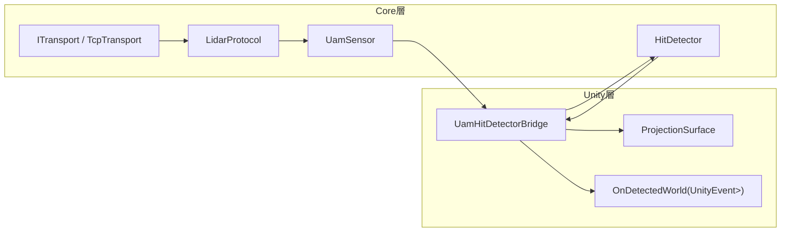
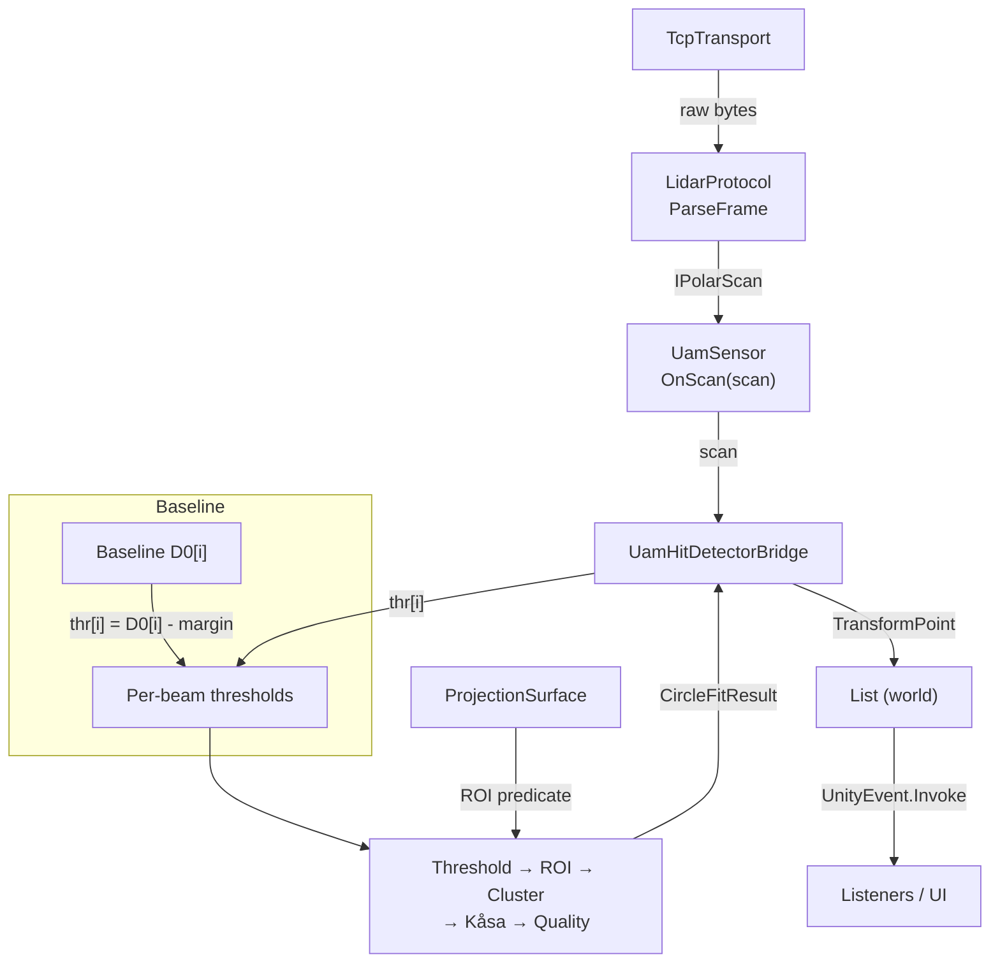
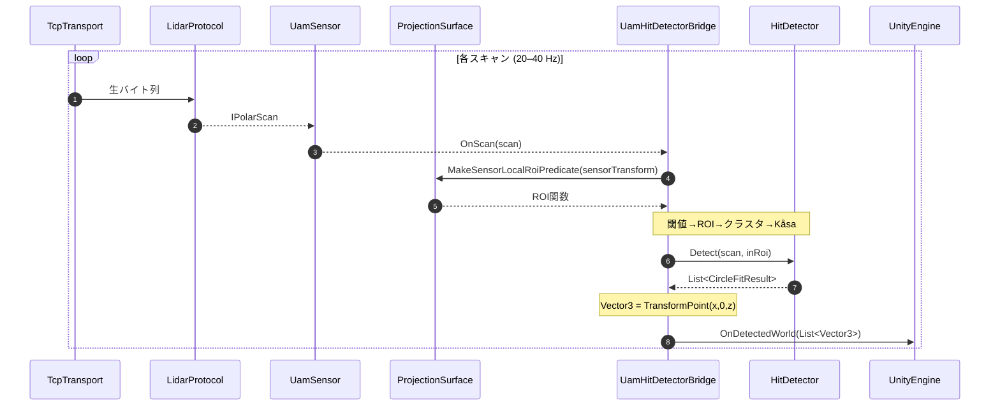

# 進捗メモ

## 現状把握
- `Assets/Shogo0x2e/HokuyoUam05lpForUnity/Runtime/UamSensor.cs` は通信制御からフレーム解析、極座標→XY変換までを一つに抱えており、`OnPositionDetected` で `Vector2[]` を渡すだけの仕組みになっている。低レベルなスキャンデータ（`IPolarScan`）を扱いたいので、責務分割が必要。
- `Assets/Shogo0x2e/HokuyoUam05lpForUnity/Runtime/Internal/UamClient.cs` には再接続ロジック・コマンドハンドシェイク・ASCII パースなどが詰まっている。これを元に `TcpTransport`（ソケット制御）と `LidarProtocol`（フレーム→`IPolarScan` 変換）を切り出せる。
- タッチ検出に関する処理（ROI、クラスタリング、Kåsa フィット等）はまだ存在しない。既存の `UamPointCloudVisualizer` は取得した XY 点群を描画するだけ。
- 本プロトタイプでは後方互換性を考慮しなくてよい。既存 API の破壊的変更も許容する。

## 実装ロードマップ
1. **コア抽象化の導入**  
   `ITransport` / `TcpTransport`、`IPolarScan`（必要なら `PolarScan` 構造体）、`LidarProtocol` を新設し、`UamSensor` がそれらを利用するようリファクタ。  
   既存の `UamClient` からソケット制御とフレーム解析を分離し、責務を整理する。
2. **`UamSensor` の再設計**  
   スキャン取得イベントを `OnScan(IPolarScan scan)` として公開し、Unity 友好な `Vector2[]` は必要であれば別レイヤーで生成。  
   Unity メインスレッドへディスパッチするかどうかをオプションで切り替え可能にする（デフォルトはメインスレッド）。
3. **`ProjectionSurface` とキャリブレーションツール**  
   投影面 (width/height/depth tolerance) を保持する MonoBehaviour と、センサ座標系での ROI 判定関数 `Func<Vector2, bool>` を生成する仕組みを追加。  
   無人状態で得られる基準距離 `D0[i]` を Editor 拡張でキャプチャし、ScriptableObject などで保存する。
4. **`HitDetector` の新規実装**  
   しきい値判定 (`R[i] < D0[i] - margin`)、ROI フィルタ、ビーム連続性や距離に基づくクラスタリング、Kåsa 円フィット、RMSE による品質フィルタまでを順に構築。  
   円フィット結果を表す `CircleFitResult`、ROI 判定用デリゲート型 `RoiPredicate` 等を定義する。
5. **`UamHitDetectorBridge` の構築**  
   センサ・投影面・検出器を連結する MonoBehaviour。  
   `OnScan` 受信→ROI 取得→`HitDetector.Detect`→`TransformPoint` でワールド座標化→`UnityEvent<List<Vector3>>` 発火までを担う。
6. **例シーンとドキュメント更新**  
   サンプルシーン/プレハブに新構成を組み込み、タッチ検出結果を可視化する簡易 UI やログを追加。  
   README/PROGRESS などの手順書を最新化し、エンドユーザーが試せる状態にまとめる。

## 決定事項・フォローアップ
- 基準距離 `D0[i]` は Editor からキャリブレーションを行い、無人状態のスキャンをアセットとして保存する。ランタイムでの学習モードは実装しない。
- `IPolarScan` には距離だけでなく強度配列（存在すれば）も保持できるようにし、後続の品質判定で活用できる拡張性を確保する。
- Unity 向けイベントはデフォルトでメインスレッドに戻して呼び出し、オプションでバックグラウンド発火を許可する。
- CLI からの検証用に `Tests/HokuyoCore.Tests`（xUnit）を追加し、`dotnet test HokuyoUam05lpForUnity.sln` でソリューション全体のテストが実行できる状態に整備済み。

## 実装フェーズ別テスト戦略
- **フェーズ1: コア抽象化**  
  - 作業: `TcpTransport` / `LidarProtocol` / `IPolarScan` の切り出しと `UamSensor` の再配線。  
  - テスト (単体): `dotnet build`、ローカル `TcpListener` を使った疑似センサで接続→`VR/AR` ハンドシェイク→連続フレーム配信→切断・再接続を検証。  
  - テスト (Unity Editor): 既存 `UamPointCloudVisualizer` が正常に点群を描画するか手動チェック。
- **フェーズ2: `UamSensor` イベント整理**  
  - 作業: `OnScan(IPolarScan)` 公開、`OnPositionDetected` の新実装、メインスレッドオプション追加。  
  - テスト (単体): `LidarProtocol` から生成したテスト `IPolarScan` を `UamSensor` に注入し、メインスレッド／バックグラウンド両モードのイベント発火順序を Assert。  
  - テスト (Unity Editor): 擬似スキャン送出ツールで `OnScan` を発火させ、ビジュアライザが継続動作するか確認。
- **フェーズ3: 投影面 & キャリブレーション**  
  - 作業: `ProjectionSurface` 作成、ROI 判定メソッド実装、Editor キャリブレーションツールで `D0` アセット生成。  
  - テスト (単体): ROI 判定の境界ケース（中心/辺上/コーナー/回転後のポイント）と `D0` アセットのシリアライズ／デシリアライズ確認。  
  - テスト (Unity Editor): キャリブレーションウィンドウからアセットを作成→保存→再ロードして値が保持されるか確認。
- **フェーズ4: `HitDetector`**  
  - 作業: しきい値→ROI→クラスタ→Kåsa→品質フィルタを実装。  
  - テスト (単体): 合成データでヒットなし／単一ヒット／複数クラスタ／ノイズ混在のケースを NUnit で網羅。  
  - テスト (Unity Editor): Editor 上で擬似スキャンを入力し、検出結果が SceneView Gizmo やログで意図通りになるか手動確認。
- **フェーズ5: `UamHitDetectorBridge`**  
  - 作業: センサ・投影面・検出器の統合、閾値管理、ワールド座標化、UnityEvent 発火。  
  - テスト (単体): ブリッジにモック `IPolarScan` を渡し、ワールド座標変換とイベント発火順序を確認。  
  - テスト (Unity Editor): Play Mode テストまたは手動操作で検出結果が UnityEvent のリスナーに渡り、TransformPoint の結果と一致するか確認。
- **フェーズ6: サンプル/ドキュメント**  
  - 作業: サンプルシーン更新、README などの説明を刷新。  
  - テスト (単体): `dotnet build`、主要スクリプトの `#if UNITY_EDITOR` 依存がないか確認。  
  - テスト (Unity Editor): サンプルシーンを起動し、タッチ検出 UI/ログが動作するか、Play Mode テストでリグレッションがないかチェック。

## フェーズ1進捗ログ（2025-10-26）
- `ITransport`/`TcpTransport`、`LidarProtocol`、`IPolarScan`/`PolarScan` を追加して `UamClient`・`UamSensor` を段階的に分離。既存 API (`OnPositionDetected`) は維持しつつ、今後の `OnScan(IPolarScan)` 公開に備えた。
- `dotnet build HokuyoUam05lpForUnity.sln` でエラーなしを確認。CLI でのビルド時間は約 1.4 秒。
- Unity 6000.2.6f2 エディタで実機 UAM を接続し、フェーズ1構成で連続スキャン → `UamPointCloudVisualizer` の点群描画が継続することを手動検証。切断→自動再接続も期待通り動作。
- 気づき: keep-alive が 5 秒間隔のため、ネットワーク遅延が大きい環境では `_frameTimeout` (3 秒) がトリガして AR02 を投げ直す挙動になる。将来は閾値を設定ファイル化するか、プロファイルごとに調整できるようにしたい。
- ルール追加: 新規インタフェースを導入する際は XML ドキュメントコメントで役割・イベント・プロパティを詳述しておく（今回の `ITransport` / `IPolarScan` で実践）。

## 参考ダイアグラム

