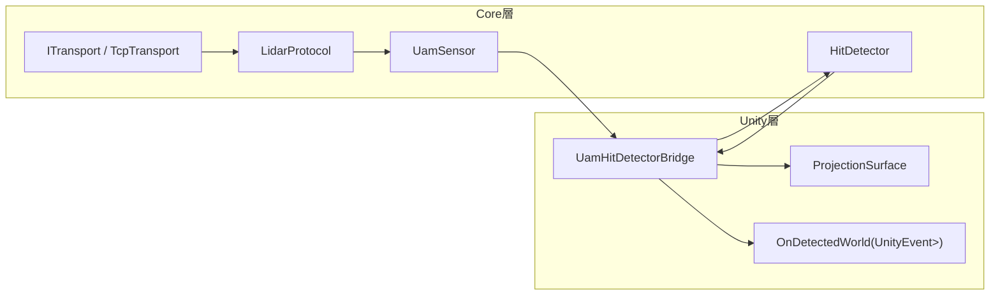
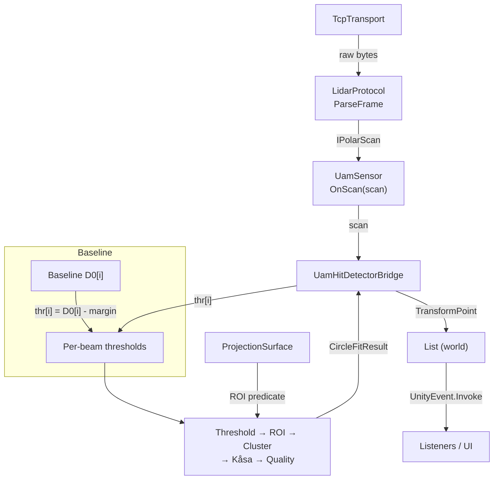
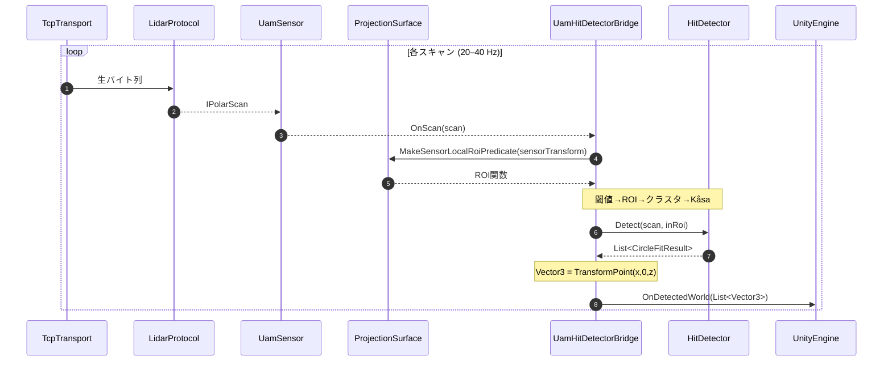

# 進捗メモ

## 指示
ユーザとのやり取りは全て日本語で行うこと。
作業を進める前に Unity MCP が利用可能であることを確認 し、利用できない場合は「Unity MCP を使えません」とユーザに伝えて 作業を中断 すること。

また、Unity MCP を積極的に活用し、可能な限り「残りは Play Mode で試すだけ」となるように作業を進めること。
つまり、実装・設定・依存関係の構築などは MCP 上で完結させ、Play Mode の実行による Console のログチェック、作業指示者が Unity Editor 上で行うべき作業は最小限（Play Mode による成果物チェックのみ）となるよう最大限努力すること。

## 現状把握
- `Assets/Shogo0x2e/HokuyoUam05lpForUnity/Runtime/UamSensor.cs` は通信制御からフレーム解析、極座標→XY変換までを一つに抱えており、`OnPositionDetected` で `Vector2[]` を渡すだけの仕組みになっている。低レベルなスキャンデータ（`IPolarScan`）を扱いたいので、責務分割が必要。
- `Assets/Shogo0x2e/HokuyoUam05lpForUnity/Runtime/Internal/UamClient.cs` には再接続ロジック・コマンドハンドシェイク・ASCII パースなどが詰まっている。これを元に `TcpTransport`（ソケット制御）と `LidarProtocol`（フレーム→`IPolarScan` 変換）を切り出せる。
- タッチ検出に関する処理（ROI、クラスタリング、Kåsa フィット等）はまだ存在しない。既存の `UamPointCloudVisualizer` は取得した XY 点群を描画するだけ。
- 本プロトタイプでは後方互換性を考慮しなくてよい。既存 API の破壊的変更も許容する。

## 実装ロードマップ
1. **コア抽象化の導入**  
   `ITransport` / `TcpTransport`、`IPolarScan`（必要なら `PolarScan` 構造体）、`LidarProtocol` を新設し、`UamSensor` がそれらを利用するようリファクタ。  
   既存の `UamClient` からソケット制御とフレーム解析を分離し、責務を整理する。
2. **`UamSensor` の再設計**  
   スキャン取得イベントを `OnScan(IPolarScan scan)` として公開し、Unity 友好な `Vector2[]` は必要であれば別レイヤーで生成。  
   Unity メインスレッドへディスパッチするかどうかをオプションで切り替え可能にする（デフォルトはメインスレッド）。
3. **`ProjectionSurface` とキャリブレーションツール**  
   投影面 (width/height/depth tolerance) を保持する MonoBehaviour と、センサ座標系での ROI 判定関数 `Func<Vector2, bool>` を生成する仕組みを追加。  
   無人状態で得られる基準距離 `D0[i]` を Editor 拡張でキャプチャし、ScriptableObject などで保存する。
4. **`HitDetector` の新規実装**  
   しきい値判定 (`R[i] < D0[i] - margin`)、ROI フィルタ、ビーム連続性や距離に基づくクラスタリング、Kåsa 円フィット、RMSE による品質フィルタまでを順に構築。  
   円フィット結果を表す `CircleFitResult`、ROI 判定用デリゲート型 `RoiPredicate` 等を定義する。
5. **`UamHitDetectorBridge` の構築**  
   センサ・投影面・検出器を連結する MonoBehaviour。  
   `OnScan` 受信→ROI 取得→`HitDetector.Detect`→`TransformPoint` でワールド座標化→`UnityEvent<List<Vector3>>` 発火までを担う。
6. **例シーンとドキュメント更新**  
   サンプルシーン/プレハブに新構成を組み込み、タッチ検出結果を可視化する簡易 UI やログを追加。  
   README/PROGRESS などの手順書を最新化し、エンドユーザーが試せる状態にまとめる。

## 決定事項・フォローアップ
- 基準距離 `D0[i]` は Editor からキャリブレーションを行い、無人状態のスキャンをアセットとして保存する。ランタイムでの学習モードは実装しない。
- `IPolarScan` には距離だけでなく強度配列（存在すれば）も保持できるようにし、後続の品質判定で活用できる拡張性を確保する。
- Unity 向けイベントはデフォルトでメインスレッドに戻して呼び出し、オプションでバックグラウンド発火を許可する。
- CLI からの検証用に `Tests/HokuyoCore.Tests`（xUnit）を追加し、`dotnet test HokuyoUam05lpForUnity.sln` でソリューション全体のテストが実行できる状態に整備済み。

## 実装フェーズ別テスト戦略
- **フェーズ1: コア抽象化**  
  - 作業: `TcpTransport` / `LidarProtocol` / `IPolarScan` の切り出しと `UamSensor` の再配線。  
  - テスト (単体): `dotnet build`、ローカル `TcpListener` を使った疑似センサで接続→`VR/AR` ハンドシェイク→連続フレーム配信→切断・再接続を検証。  
  - テスト (Unity Editor): 既存 `UamPointCloudVisualizer` が正常に点群を描画するか手動チェック。
- **フェーズ2: `UamSensor` イベント整理**  
  - 作業: `OnScan(IPolarScan)` 公開、`OnPositionDetected` の新実装、メインスレッドオプション追加。  
  - テスト (単体): `LidarProtocol` から生成したテスト `IPolarScan` を `UamSensor` に注入し、メインスレッド／バックグラウンド両モードのイベント発火順序を Assert。  
  - テスト (Unity Editor): 擬似スキャン送出ツールで `OnScan` を発火させ、ビジュアライザが継続動作するか確認。
- **フェーズ3: 投影面 & キャリブレーション**  
  - 作業: `ProjectionSurface` 作成、ROI 判定メソッド実装、Editor キャリブレーションツールで `D0` アセット生成。  
  - テスト (単体): ROI 判定の境界ケース（中心/辺上/コーナー/回転後のポイント）と `D0` アセットのシリアライズ／デシリアライズ確認。  
  - テスト (Unity Editor): キャリブレーションウィンドウからアセットを作成→保存→再ロードして値が保持されるか確認。
- **フェーズ4: `HitDetector`**  
  - 作業: しきい値→ROI→クラスタ→Kåsa→品質フィルタを実装。  
  - テスト (単体): 合成データでヒットなし／単一ヒット／複数クラスタ／ノイズ混在のケースを NUnit で網羅。  
  - テスト (Unity Editor): Editor 上で擬似スキャンを入力し、検出結果が SceneView Gizmo やログで意図通りになるか手動確認。
- **フェーズ5: `UamHitDetectorBridge`**  
  - 作業: センサ・投影面・検出器の統合、閾値管理、ワールド座標化、UnityEvent 発火。  
  - テスト (単体): ブリッジにモック `IPolarScan` を渡し、ワールド座標変換とイベント発火順序を確認。  
  - テスト (Unity Editor): Play Mode テストまたは手動操作で検出結果が UnityEvent のリスナーに渡り、TransformPoint の結果と一致するか確認。
- **フェーズ6: サンプル/ドキュメント**  
  - 作業: サンプルシーン更新、README などの説明を刷新。  
  - テスト (単体): `dotnet build`、主要スクリプトの `#if UNITY_EDITOR` 依存がないか確認。  
  - テスト (Unity Editor): サンプルシーンを起動し、タッチ検出 UI/ログが動作するか、Play Mode テストでリグレッションがないかチェック。

## フェーズ1進捗ログ（2025-10-26）
- `ITransport`/`TcpTransport`、`LidarProtocol`、`IPolarScan`/`PolarScan` を追加して `UamClient`・`UamSensor` を段階的に分離。既存 API (`OnPositionDetected`) は維持しつつ、今後の `OnScan(IPolarScan)` 公開に備えた。
- `dotnet build HokuyoUam05lpForUnity.sln` でエラーなしを確認。CLI でのビルド時間は約 1.4 秒。
- Unity 6000.2.6f2 エディタで実機 UAM を接続し、フェーズ1構成で連続スキャン → `UamPointCloudVisualizer` の点群描画が継続することを手動検証。切断→自動再接続も期待通り動作。
- 気づき: keep-alive が 5 秒間隔のため、ネットワーク遅延が大きい環境では `_frameTimeout` (3 秒) がトリガして AR02 を投げ直す挙動になる。将来は閾値を設定ファイル化するか、プロファイルごとに調整できるようにしたい。
- ルール追加: 新規インタフェースを導入する際は XML ドキュメントコメントで役割・イベント・プロパティを詳述しておく（今回の `ITransport` / `IPolarScan` で実践）。

## フェーズ2進捗ログ（2025-10-26）
- `UamSensor` が新しい `OnScan(IPolarScan)` コールバックを公開し、生データを上位層へ伝搬できるようにした。
- `OnPositionDetected` は `OnScan` ベースで極→XY変換を実施し、ハンドラー未登録時はバッファ割り当てを回避するよう最適化。
- `DispatchEventsOnUnityThread` オプションを追加し、イベントを Unity メインスレッドへ戻すかバックグラウンドで受け取るかを制御できるようにした（既定はオン）。
- `dotnet build HokuyoUam05lpForUnity.sln` でコンパイル確認（ビルド成功、約 1.1 秒）。

### Play Mode 検証手順（2025-10-26）
1. 空のシーンを作成し、`UamSensor` コンポーネントをアタッチ（`AutoStart` を **オフ**、`DispatchEventsOnUnityThread` は検証したい設定に切り替え）。  
2. 同じ GameObject に `UamSensorMockDriver`（新規）を追加し、`Sensor` フィールドに前項の `UamSensor` を割り当てる。  
   - Sweep 動作を確認したい場合は `SweepPeriodSeconds` を 2–3 秒程度に設定。固定ビームを見たい場合は 0 以下にし、`StaticBeamIndex` を指定。  
   - 強度データが必要なら `EmitIntensity` をオンにする。  
3. イベントの発火状況を可視化するため、`UamSensorEventLogger` を追加（同じ GameObject で可）。`SampleBeamIndex` をハイライト予定のビームに合わせる。  
4. Play Mode に入り、`UamSensorMockDriver` が想定どおりに `OnScan`/`OnPositionDetected` をトリガしているか Console と Scene ビューで確認。`UamSensorCoordinateLogger` を併用すると XY 点群の分布も把握しやすい。  
5. `DispatchEventsOnUnityThread` をオフに切り替えて再生し、`UamSensorEventLogger` の `thread=...` 表示で呼び出しスレッドが変化することを確認。必要に応じて `EmitIntervalSeconds` を下げて高頻度動作を確認する。

### フェーズ2の気づき・注意
- `UamSensorEventLogger` は全フレームを Console に出力するため、`EmitIntervalSeconds` が小さいとログが氾濫する。検証時は `LogOnScan`/`LogOnPositionDetected` を状況に応じて切り替える。  
- `UamSensorMockDriver` はリフレクションで `UamSensor.HandleFrame` にアクセスしている。シグネチャ変更時は `EnsureHandleBound` でエラーになるので、フェーズ3以降で `UamSensor` を触る場合はモック側の同期更新を忘れない。  
- `SetClientFactory` はセンサ起動前にのみ呼べる（内部でロック／ガード済み）。Play Mode モック以外でも依存差し替えを行う場合は、`StartSensorAsync` 直前にセットする。

## 参考ダイアグラム

## フェーズ3メモ（2025-10-28）
- `ProjectionSurface` は Unity の再コンパイル完了後でないと `Component > Hokuyo UAM` に表示されない。表示されない場合は Console のエラーを解消してから `Add Component` 検索欄で `ProjectionSurface` を直接検索する。  
- キャリブレーションウィンドウは Play Mode 中に `UamSensor.OnScan` を購読するため、Play Mode を開始してスキャンが流れている状態で開く（または開き直す）こと。停止中は「まだスキャンデータを受信していません」が出続ける。  
- `UamSensor` を実機で使う際は `Ip`/`Port` と `AutoStart` を確認し、ログに `[UamSensor] Connected` が出るかチェック。モック検証時は `UamSensorMockDriver.Sensor` に対象センサを割り当てておく。  
- 保存したアセットは `ProjectionSurface.Calibration` に割り当ててシーンを保存する。複数モードでキャプチャする場合は同一アセットに追記してもよい（モードごとに日付とメモを残すと識別しやすい）。  
- `UamSensorEventLogger` を併用すると Play Mode 中に `OnScan` がどのくらい呼ばれているか確認できる。スキャンが停止した場合はネットワーク疎通やセンサ側のストリーム設定を再確認する。

## フェーズ4メモ（2025-10-29）
- `Runtime/Detection/HitDetector` の初期実装は ROI（`ProjectionSurface` の平面）と距離レンジでビームをフィルタリングし、該当するステップ番号とセンサ座標を `HitDetection` として列挙するだけのシンプルな状態。しきい値やクラスタリングは未実装とし、まずはステップ列の可視化に集中する。  
- `HitDetection` / `HitObservation` でセンサ平面→ワールド変換の結果を保持。`HitObservation.SensorPoint3` は `PointCloudVisualizer` 等の Gizmo 補助用。  
- `Runtime/Detection/UamHitDetectorBridge` が `UamSensor.OnScan` を購読し、ROI 関数を都度生成してヒット一覧を更新。`OnDetections` (UnityEvent) で `List<HitObservation>` を通知しつつ、最新結果は `CopyLatestObservations` からスナップショット取得できる。`logDetections` をオンにするとヒット数とステップ番号を Console へ出力。  
- ブリッジはセンサ Transform が未割り当ての場合もステップ一覧を確保できるようにし、ワールド座標はゼロベクトルで埋める。

## フェーズ5メモ（2025-10-29）
- `Examples/Scripts/HitPrefabVisualizer` を追加。`UamHitDetectorBridge` の `OnDetections` へ接続し、ヒット位置にプレハブ（未指定時は球 Primitive）をプールして表示。ステップ番号は Hierarchy 名へ反映される。  
- `PointCloudVisualizer` と併用すると、ROI 内に入ったビームのステップ番号をシーン上で即座に確認できる。Prefab の差し替えで Billboard や TextMesh 等の表現に切り替え可能。  
- ブリッジの Gizmo 描画と Prefab 可視化を組み合わせることで、Kåsa 等のフィッティング処理を導入する前にセンサ→ROI の通過ステップ列を手早く検証できる。  
- Play Mode 用の `HitDetectorMock.unity` シーンを追加。`UamSensor` + `UamSensorMockDriver` + `ProjectionSurface`（センサ子オブジェクト, Z=1.2m）+ `UamHitDetectorBridge` + `HitPrefabVisualizer` + `UamPointCloudVisualizer` がセットアップ済みで、再生すると ROI 内ヒットが球マーカーと Gizmo で表示される。`ProjectionSurface` はセンサ平面 (XZ) と平行に扱う仕様へ調整済み。
- `UamHitDetectorBridge.logDetections` を有効にすると、ROI 内で検出されたビームのステップ番号とワールド座標が Console に出力されるよう改善。`HitPrefabVisualizer` はヒット地点へマーカーを設置し、検出後も約 5 秒間残すようライフタイム制御を追加した。
- `ProjectionSurface.MakeSensorLocalRoiPredicate` の行列変換が System.Numerics 向けに正しい転置・平行移動を行うよう修正し、センサローカル→表面ローカル判定でのズレを解消。シーン側も `Projection Surface` をセンサ子のまま `localPosition (0,0,1.2)` / `localRotation (0,0,0)` に統一し、正面 (＋Z) ビームが ROI 中心を通過する構成を確定した。
- Unity MCP から Play Mode を駆動して Mock Driver のスイープを確認。Console で `[UamHitDetectorBridge] Hits=9, Steps=[512…520]` ログと Prefab マーカー生成を確認でき、ROI 内ビームが期待のステップ範囲で検出されることを実機レスで再現できた。検証前後で `dotnet build HokuyoUam05lpForUnity.sln` も通過。
- HitDetector は短距離ビームのクラスタリング（デフォルト 10cm 閾値）を行い、クラスターごとに最短ビームを返すよう拡張。`GroupingDistanceMeters` でグループ判定を調整できる。
- `UamSensorMockDriver` にハイライトオフセット配列（長・短・長のばらつきを再現）とランダム揺らぎを導入。ROI 内に複数距離が混在するようになり、最短ビームを継続的にテストしやすくした。Play Mode 開始時に `Application.runInBackground = true` を強制し、停止時に元へ戻す処理も組み込み済み。
- `UamSensorMockDriver` に複数クラスター設定 (`AdditionalClusters`) を追加。Sweep の基準ビームから相対オフセットと距離を指定して複数の短距離パターンを同時生成できる。
